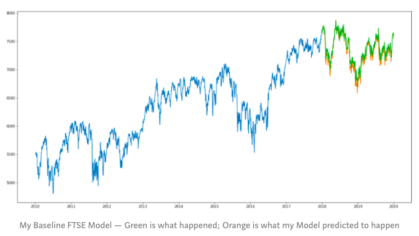
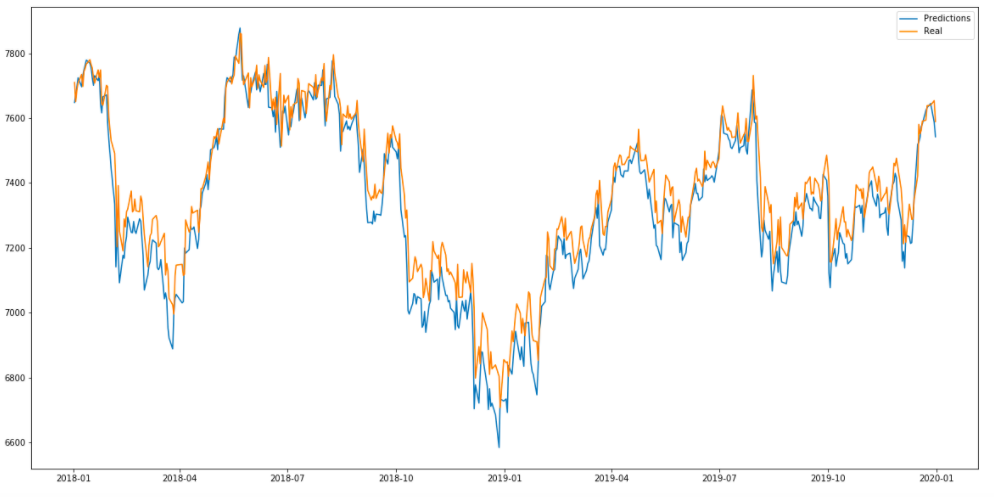

# Overview

In this project, I attempted to improve LSTM models making predictions on the price of the FTSE100 and S&P500. I theorised that they might be improved by encorporating some measure of the population's confidence in the economy, which might be mirrored by the tone of the newspapers they read.

First, I build baseline models to predict the movement of these two indexes, training the model only on past prices.

Then, I analysed the tone of Newspaper Headlines over the same period of time, using TextBlob, a NLP Toolkit.

Finally, I incorporated this new data into the models, to see if it improved their predictive power.

# Findings

Although my finding on the S&P were inconclusive, my FTSE model was improved by more than 2%. 

Given that this was a relatively simple framework, I would make the business recommendation that this was worth some further investigation. Due to the stociatic nature of LSTM models (giving slightly different results everytime), the first step would be to invest in some extra computing power (cloud computing would my recommeded option) to train these models repeated, and get a more conclusive result of the power of this method.

This plot displays the validation set (2018 & 2019), and I used its MSE as my comparison to the previous Model.  

Please feel free to look through my ProjectNotebook file for a much more detailed look at the project, or simply read my blog post of a walk through my project:

https://medium.com/@tomribaroff/improving-stock-market-predictions-using-natural-language-processing-120d1fdc0ff4

# Repository Contents

ProjectNotebook.ipynb is a Jupyter Notebook File with detailed code of the entire project. It includes the Abstract for project's results, as well as an in depth look at the code involved. 

Obtain&Scrub is a Jupyter Notebook file on the Data Collection part of this work. It is separate from the main notebook as the file was getting too large. 

UnusedCode.ipynb is a Jupyter Notebook File with code that I didn't use in my final analysis, but that I think might be useful for anyone else working on this/a similar project. 

APIfunction.py is a python code file which I wrote, which includes the functions I used as part of my analysis on my API responses

Headlines.csv is a CSV file which I created, saving the information which I requested from the API, after my edits

nyt_news_data is a folder containing text files of the responses I got from the NYT API - it was better to save, than make the same repeated requests

Improving Stock Market Predictions...pdf is a short pdf of slides I used in presentation
